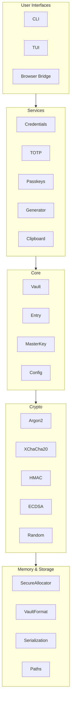
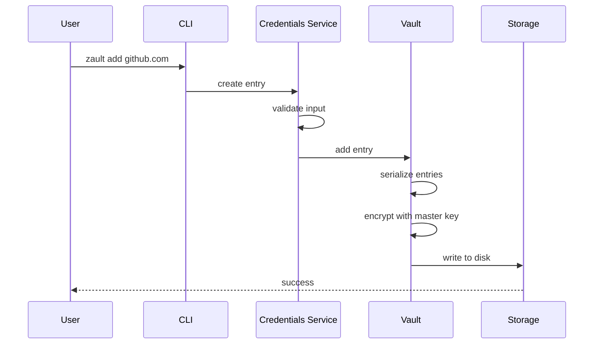
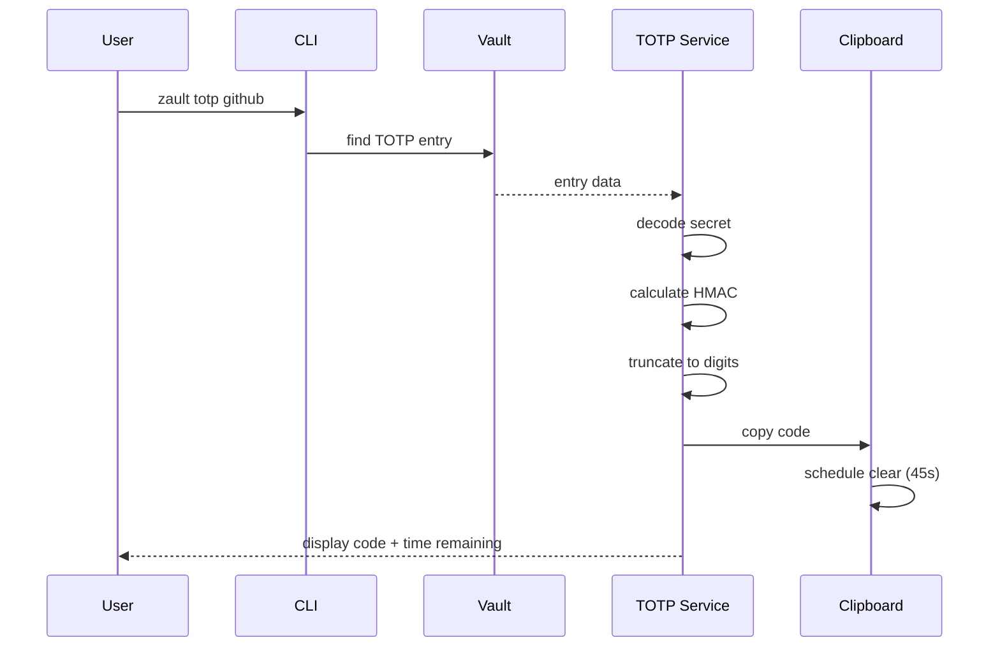
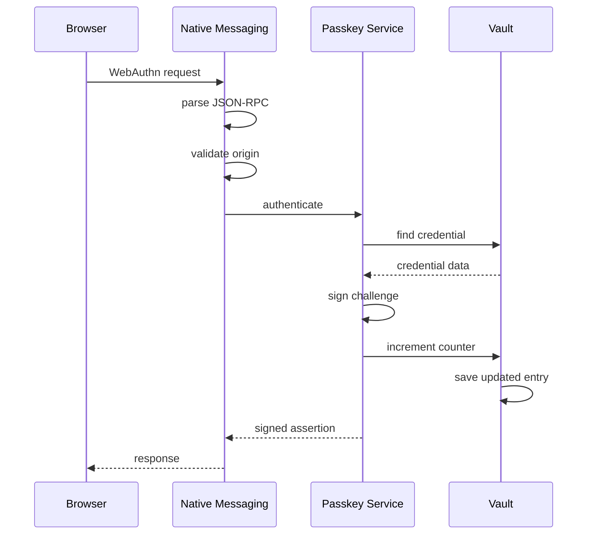
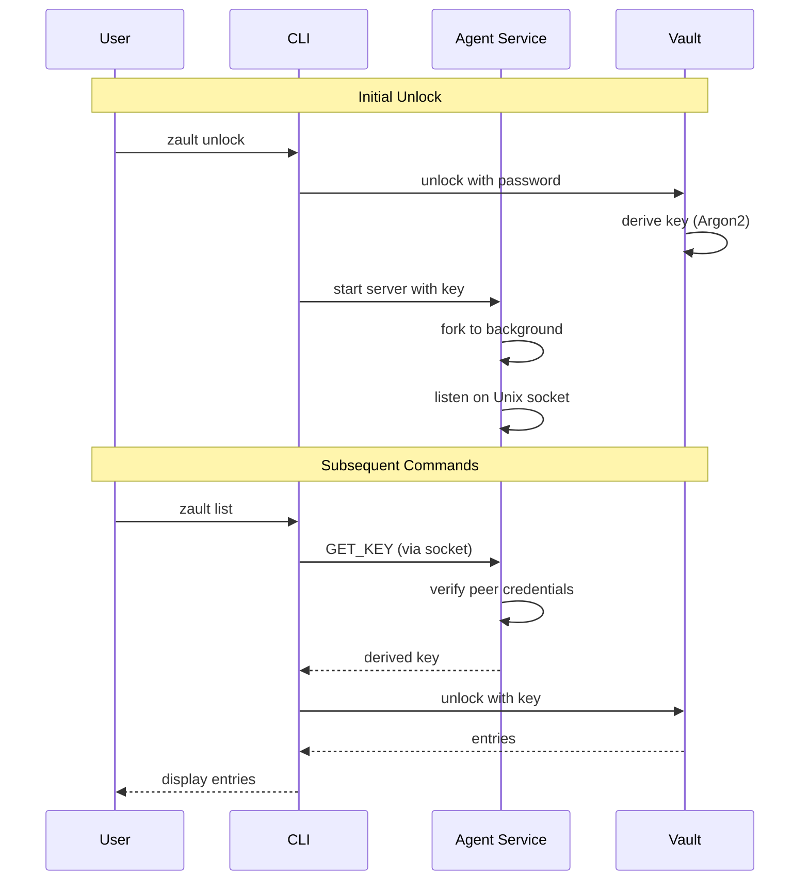

# Architecture

## Overview

zault is built with a layered architecture, separating concerns for maintainability and security.



## Module Responsibilities

### CLI (`src/cli/`)

Command-line interface parsing and execution.

- `root.zig` - Argument parsing, command dispatch
- `commands.zig` - Individual command implementations
- `output.zig` - Formatted output (text, JSON)

### TUI (`src/tui/`)

Terminal user interface with interactive features.

- `app.zig` - Application state, event loop
- `views/` - Different screens (entries, TOTP, passkeys)
- `widgets/` - Reusable UI components

### Core (`src/core/`)

Central data structures and vault management.

- `vault.zig` - Vault encryption/decryption, CRUD operations
- `entry.zig` - Entry types (password, TOTP, passkey)
- `master_key.zig` - Key derivation and management
- `config.zig` - Application configuration

### Services (`src/services/`)

Business logic for specific features.

- `credentials.zig` - Password entry management
- `totp.zig` - TOTP generation and verification
- `passkey.zig` - WebAuthn credential handling
- `generator.zig` - Password/passphrase generation
- `clipboard.zig` - Clipboard operations with auto-clear
- `agent.zig` - Background agent for credential caching (ssh-agent style)

### Crypto (`src/crypto/`)

Cryptographic operations wrappers.

- `argon2.zig` - Key derivation (via libsodium)
- `xchacha.zig` - Vault encryption
- `hmac.zig` - TOTP calculation
- `ecdsa.zig` - Passkey signing
- `random.zig` - Secure random generation

### Memory (`src/memory/`)

Secure memory handling.

- `secure_allocator.zig` - mlock + zeroing allocator
- `secret.zig` - Secret wrapper type

### Storage (`src/storage/`)

Persistence and file formats.

- `format.zig` - Vault binary format
- `serialization.zig` - Entry serialization
- `paths.zig` - XDG path resolution

### WebAuthn (`src/webauthn/`)

Passkey/FIDO2 support.

- `cbor.zig` - CBOR encoding/decoding
- `authenticator.zig` - Authenticator data structures
- `attestation.zig` - Attestation handling
- `assertion.zig` - Assertion signing

### Bridge (`src/bridge/`)

Browser integration.

- `native_messaging.zig` - Chrome/Firefox native messaging
- `protocol.zig` - JSON-RPC protocol

## Data Flow

### Adding a Password



### Getting a TOTP Code



### Passkey Authentication



### Agent-Based Unlock



## Error Handling

All errors are strongly typed using Zig's error unions.

```zig
const VaultError = error{
    VaultNotFound,
    VaultLocked,
    VaultCorrupted,
    InvalidMasterPassword,
    EntryNotFound,
    EntryAlreadyExists,
    IoError,
    CryptoError,
};
```

Errors propagate up to the UI layer, which formats them for display.

## Testing Strategy

1. **Unit tests** - Each module has tests in the same file
2. **Integration tests** - `tests/` directory
3. **Fuzzing** - Parsing code should be fuzzed
4. **Property tests** - Crypto round-trips

Run tests:
```bash
zig build test
```
