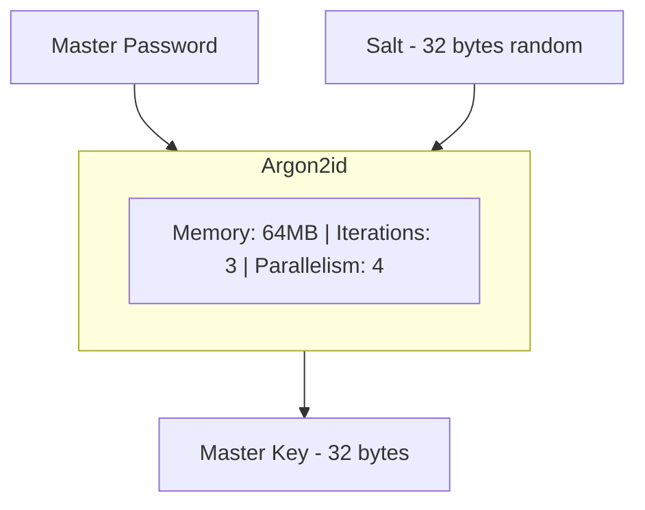
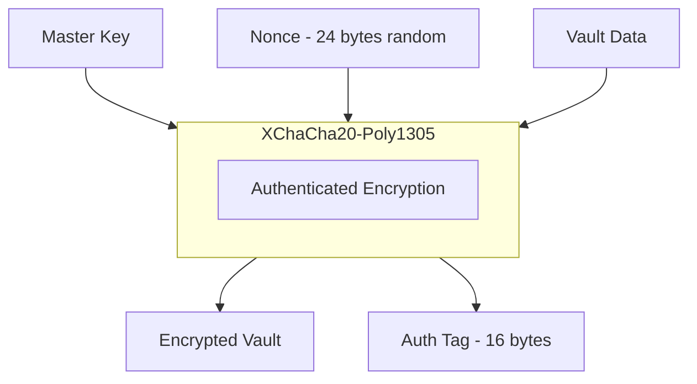
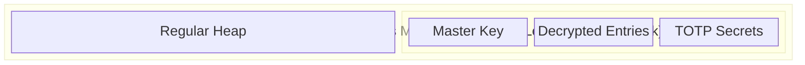
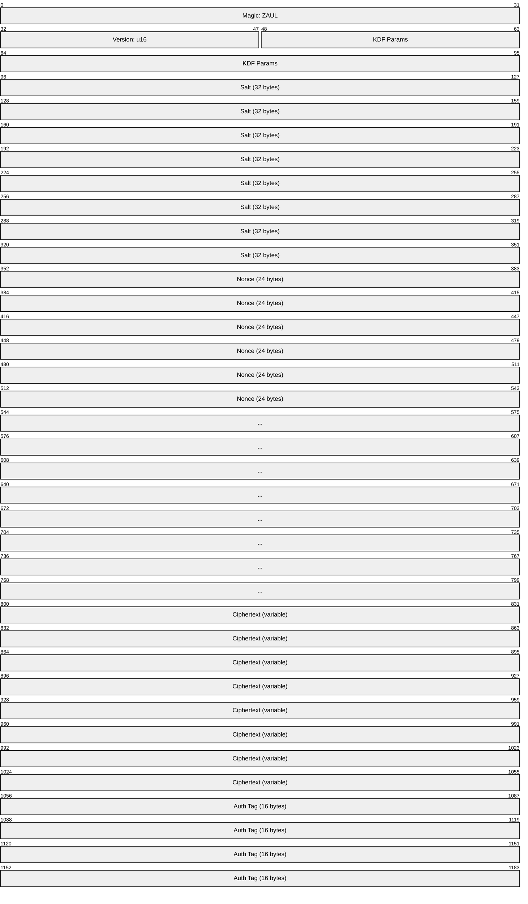

# Security Model

This document describes the security architecture of zault.

## Threat Model

### What we protect against

1. **Offline attacks** - Attacker has access to the vault file
2. **Memory dumps** - Attacker can read process memory
3. **Clipboard sniffing** - Malware monitoring clipboard
4. **Shoulder surfing** - Attacker can see your screen

### What we don't protect against

1. **Compromised system** - Keyloggers, rootkits
2. **Physical access** - Attacker with physical device access
3. **Rubber hose cryptanalysis** - Coercion

## Cryptographic Design

### Key Derivation

**Why Argon2id?**
- Memory-hard: Resistant to GPU/ASIC attacks
- Side-channel resistant (unlike Argon2i)
- Winner of Password Hashing Competition
- OWASP recommended

### Vault Encryption

**Why XChaCha20-Poly1305?**
- AEAD: Encryption + authentication in one
- 24-byte nonce: Safe for random generation
- No padding oracle attacks
- Constant-time implementation

### TOTP

- RFC 6238 compliant
- Supports SHA-1, SHA-256, SHA-512
- Secrets stored encrypted in vault

### Passkeys

- Ed25519 or ECDSA P-256 key pairs
- Private keys encrypted in vault
- Challenge-response with origin validation

## Memory Security

### Sensitive Data Handling

1. **Locked memory** - Secrets allocated with `mlock()` to prevent swapping
2. **Zeroing** - All sensitive data zeroed before deallocation
3. **No GC** - Zig has no garbage collector, giving us deterministic memory control
4. **Minimal copies** - Secrets are not copied unnecessarily

### Memory Layout

## Clipboard Security

1. **Auto-clear** - Clipboard cleared after 45 seconds (configurable)
2. **No history** - We attempt to prevent clipboard managers from recording

## Vault Format

| Section | Size | Description |
|---------|------|-------------|
| Header | 96 bytes | Unencrypted metadata |
| Magic | 4 bytes | "ZAUL" identifier |
| Version | 2 bytes | Format version |
| KDF params | varies | Argon2 parameters |
| Salt | 32 bytes | Random salt |
| Nonce | 24 bytes | XChaCha20 nonce |
| Ciphertext | variable | Encrypted entries |
| Auth Tag | 16 bytes | Poly1305 tag |

## Security Recommendations

### For Users

1. Use a strong master password (20+ characters, or passphrase)
2. Enable disk encryption on your device
3. Keep zault updated
4. Lock vault when not in use
5. Use the password generator

### For Developers

1. Never log sensitive data
2. Use secure allocator for all secrets
3. Constant-time comparisons for secrets
4. Fuzz all parsing code
5. Review all crypto usage

## Audit Status

This project has not been professionally audited. Use at your own risk.

If you'd like to sponsor a security audit, please open an issue.

## Reporting Vulnerabilities

Please report security vulnerabilities privately via GitHub Security Advisories.

Do not open public issues for security vulnerabilities.
